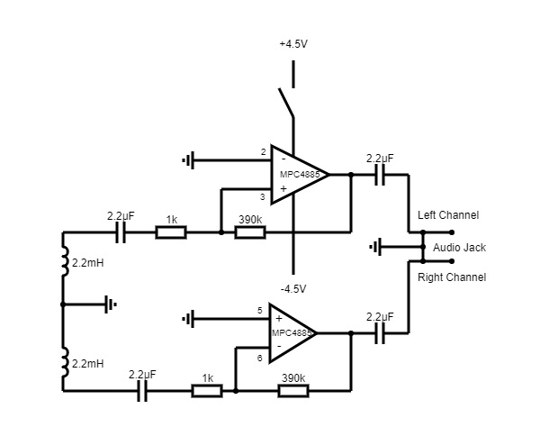

# FRDYER

The FRDYER is a musical instrument inspired on the characteristical touchless insteraction of the well-known theremin. Similar to the Theremin, the FRDYER relies on the electromagnetic field to operate. An electromagnetic microphone converts the electromagnetic fields into an oscillating signal, thus creating a sound output with a very particular character. This signal is then connected to a microcontroller which modifies the sound by passing it through a  Low Pass filter and then a Feedback Delay. This generates a looping atmospherical sound which can be modified by moving the microphone or adding different electromagnetic sources. 

The name FRDYER is a tribute to Michael Faraday, for his contributions towards the study of electromagnetic fields.

 ## Technical aspects

As stated before, the FRDYER is built upon a microphone and a signal processor. 

- ### Microphone

The microphone is based on the open source project "Electrolush" designed by Jonas Gruska. Two inductors convert the electromagnetic field into electricity which is then passed to an operational amplifier to create an oscillating signal and amplify it. An audio jack is connected to this ciruitry in order to output the signal. The microphone is powered by a 9V battery.  

- ### Processor 

A Teensy 4.0 + Audio shield Rev D constitute the sound processor. 2 potentiontimeters are used; one for changing the time of the feedback delay and one for changing the cutoff frequency of the low pass filter. 3 buttons are used, one for overdriving the feedback delay, allowing asynchronous overlapping, and one for mutting. Two 3.5mm female jacks are used for input and output. 

## Schematics

Microphone

